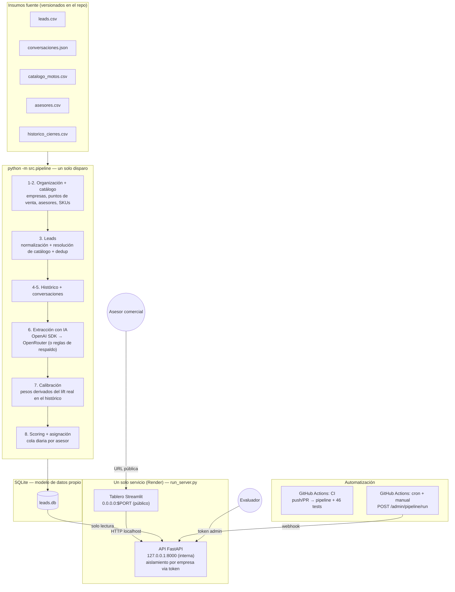

# Arquitectura

Diagrama en Mermaid (se renderiza nativamente en GitHub). Fuente de verdad
versionada, no una imagen suelta que se desactualiza.

## Flujo de datos de punta a punta

## Por qué estas decisiones

| Decisión | Razón |
|---|---|
| **SQLite en vez de un servicio de BD gestionado** | El pipeline es idempotente: reconstruye el warehouse completo en cada corrida (`src/db.py`), así que un disco efímero deja de ser un riesgo. Motor relacional real, esquema versionado en `db/schema.sql`, sin depender de un servicio externo pago para una demo. |
| **Un solo servicio Render (API interna + tablero público)** | Streamlit Cloud no puede leer el disco de Render; separar API y tablero en dos hostings distintos habría exigido HTTP entre plataformas y credenciales duplicadas. Un solo proceso (`run_server.py`) que arranca ambos y comparte el mismo disco es más simple y sigue separando responsabilidades en el código (api/ vs tablero/). |
| **El tablero nunca toca la BD directamente** | Solo habla con la API. El aislamiento por empresa vive en un único lugar (`api/auth.py`), no se puede burlar cambiando algo en el tablero. |
| **Aislamiento por token, no por parámetro** | `empresa_id` sale siempre del token Bearer autenticado, nunca de la query string. Verificado con una prueba explícita (`tests/test_api.py::test_no_se_puede_pedir_otra_empresa_por_query_param`). |
| **Extracción con IA vía SDK de OpenAI apuntando a OpenRouter** | Permite probar con modelos gratuitos y cambiar a OpenAI directo (u otro proveedor OpenAI-compatible) cambiando solo variables de entorno, sin tocar código. |
| **Extractor de reglas como respaldo** | Si `IA_HABILITADA=false` o el LLM falla tras reintentos, el pipeline sigue funcionando end-to-end. Una corrida nunca se cae por una API externa caída. |
| **"Ahora" anclado al dato más reciente del dataset, no al reloj real** | Los datos son sintéticos y fijos (ago-sep 2026). Calcular la urgencia contra la hora real del sistema habría hecho que, día tras día, todos los leads sin contactar cayeran en el bucket ">72h" y el score colapsara — el tablero dejaría de verse "de hoy" el día de la sustentación. |
